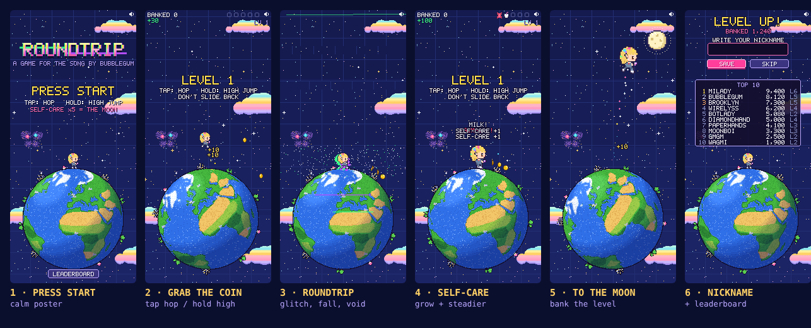

# ROUNDTRIP

A tiny pixel girl runs on a spinning globe, jumping for coins and trying not to roundtrip.
It's a quick browser game for the song **"roundtrip" by bubblegum**, about the rush and
crash of trading memecoins. The pitch is by @Brooklyn.

The globe is the market, the coins are pumps, and every jump is a trade. Coins you grab
are *unrealized* until you take profit by reaching the moon. If you roundtrip, you give it
all back. The way out isn't more coins. It's self-care: milk, gummies and sunshine
make her big enough to leap to the moon.



## Play

| | Phone | Desktop |
| --- | --- | --- |
| Hop | tap | Space / ↑ / W / click |
| High jump | hold | hold |
| Pause | — | Esc / P (also pauses when the tab is hidden) |
| Mute | speaker icon | M |

- Run against the spin. On the ground she slowly works back to the top of the globe.
- In the air the spin drags her backward. Every jump costs ground, so make it count.
- A jump that grabs nothing is a bad trade. That's **LAG**: a glitch and a shove backward.
- Red candles (from level 2) knock you back. Hop them.
- Slide too far down the globe's shoulder and you **ROUNDTRIP**. Unbanked coins are gone.
- Five self-care items make her big enough. Then jump to the moon to bank everything.
- Each level spins about 15% faster. Your banked total goes on the leaderboard.

Design notes, every decision, and the full tuning table are in [docs/DESIGN.md](docs/DESIGN.md).

## Run it locally

Needs Node 20.12+. No database is required for local play.

```bash
npm run setup    # installs the two server deps (redis, mongodb drivers)
npm run dev      # http://localhost:8787, in-memory leaderboard
```

To run against real Redis and MongoDB, copy `server/.env.example` to `server/.env`, set
`DEV_STATIC=1`, and run `npm start`.

The client also works from any static server (`npx serve public`). Without the API it
keeps the leaderboard in the browser and labels it "saved on this device".

### Jump straight to a screen

`?scene=` opens a screen directly, for testing and screenshots:
`title`, `play`, `grow`, `moon`, `roundtrip`, `nickname`, `final`, `board`.
Add `&level=3` to pick a level and `&seed=7` for a repeatable level layout.
For example, `http://localhost:8787/?scene=play&level=4&seed=7`.

## Deploy

Static files behind nginx, plus one Node process for `/api/` that uses your existing Redis and
MongoDB. Step by step, including systemd, certbot and backups:
**[deploy/DEPLOY.md](deploy/DEPLOY.md)**.

## Project layout

```
public/                 the game (vanilla JS modules, no build step)
  index.html, style.css, manifest.webmanifest, icon-*.png, og.png
  audio/roundtrip.mp3   the song (loops; tape-stops on a roundtrip)
  js/
    main.js             boot, fixed-step loop, mute button, ?scene= debug
    rules.js            scoring + level rules, shared with the server
    config.js           feel and layout tuning (spin, drift, jump, growth)
    game.js             the world: physics, spawns, collisions, roundtrip + moon sequences
    scenes/             title, play (screens 2–5), nickname (screen 6 + leaderboard)
    globe.js, geo.js    pixel Earth, rotated per pixel each frame
    sprites.js          all pixel art as text grids
    background.js       sky, grid, stars, nebula, pastel clouds
    fx.js, audio.js     particles, glitch pass, synth SFX, music + tape-stop
    input.js, render.js, font.js, ui.js, api.js, director.js
server/
  server.js             node:http API (no framework)
  lib/store.js          Redis + MongoDB (and an in-memory twin for dev/tests)
  lib/validate.js       nickname rules + plausibility checks
  test/                 node:test suites
deploy/                 nginx site, systemd unit, update script, DEPLOY.md
tools/                  sprite sheet viewer, icon / preview image maker
docs/DESIGN.md          the game design (pitch v2)
```

## Tweaking

- **Difficulty and feel**: `public/js/config.js` (`PLAYER`, `SPAWN`) and
  `public/js/rules.js` (spin per level, items per level, scoring). `rules.js` is
  shared with the server's score checks, so the two can't drift apart.
- **Art**: every sprite is a text grid in `public/js/sprites.js`. One character is one
  pixel. Open `tools/sprite-sheet.html` through any static server to see them all at 8×.
- **Globe**: continents are coarse outlines in `public/js/geo.js`. Rim scenery and the
  palette are in `public/js/globe.js`.

## Tests

```bash
npm test
```

This runs the validation and API suites against the in-memory store. To run the same API
suite against real databases, use throwaway ones, because the suite flushes the Redis DB
and drops the `roundtrip_test` Mongo database:

```bash
TEST_REDIS_URL=redis://127.0.0.1:6379/15 TEST_MONGO_URL=mongodb://127.0.0.1:27017 npm test
```

## Regenerating the icon and preview image

`tools/make-assets.html` draws them from the game's own sprites. Serve the repo root
(`npx serve .`), open `tools/make-assets.html?asset=icon&size=512`, `...&size=192`, and
`?asset=og`, then save each canvas as `public/icon-512.png`, `public/icon-192.png` and
`public/og.png`.

## Credits

- Pitch, character and concept art: @Brooklyn
- Song: "roundtrip" by bubblegum
- Inspiration: [inteligente.lol](https://inteligente.lol) by @wirelyss
